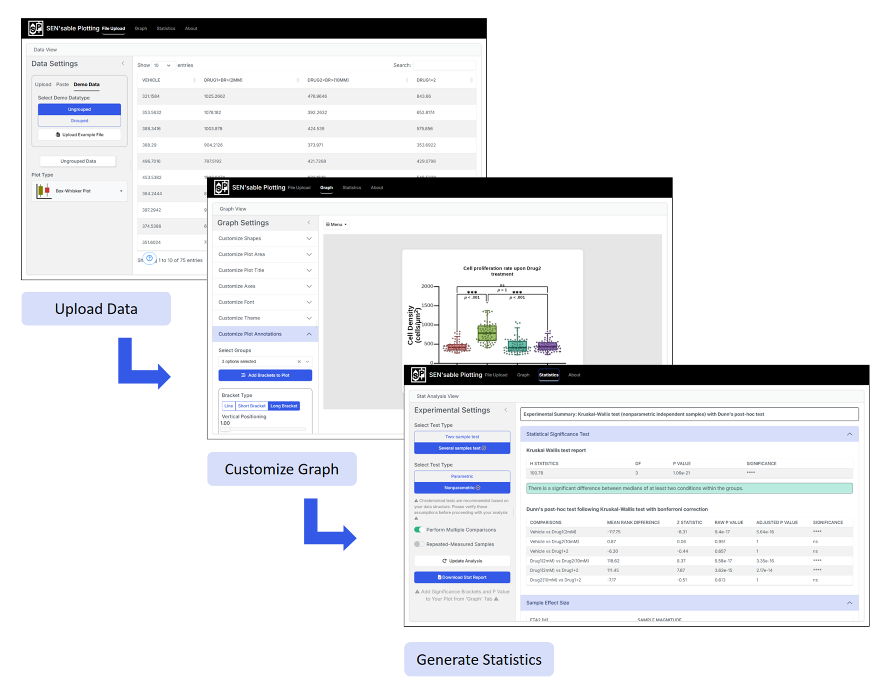
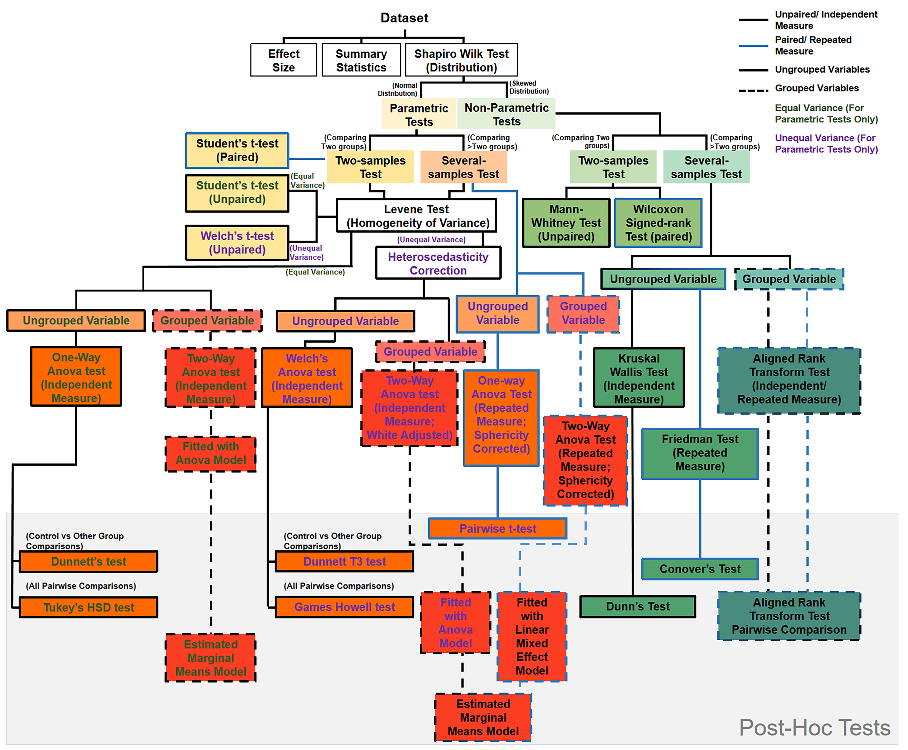

# Summary

Visual representation of data is an effective communication mechanism for the public; therefore, there are numerous tools to analyze experimental data and convert it into graphical outputs. Based on how data is collected, i.e., measured or counted, it can be categorized into continuous or discrete data types, respectively. Discrete data, sometimes referred to as categorical data, in which variables are categorized into groups, is extremely useful for measuring a population and extracting meaningful statistical information. Amongst many modern software options, R provides a great free platform for generating graphs and performing statistical analysis for hypothesis testing. However, for students or early-career researchers, learning R programming can be a hurdle. `Sensabled` is an R/Shiny app that removes the need to write complex code and provides a ‘point-and-click’ interface for analyzing and visualizing discrete data. With an option to install as an R package or use directly on the web, `Sensabled` yields publication-ready plots and statistical reports within minutes.

# Statement of Need

Working with raw categorical data and relying on simple summary statistics often underrepresents the true meaning of the data collected from any experiment. Visualization of this data through a graphical illustration provides more information about the distribution, the frequency of occurrence of certain values, outliers within a population, and even correlations between different datasets [@telea2014data]. Beyond these, discrete datasets are often collected to answer scientific questions and find out associations between variables. Testing a hypothesis about a nonzero chance of association between datasets and quantifying its strength numerically have great value in the real world [@friendly2015discrete]. R is an extremely powerful programming language for statistical analysis and provides incredible flexibility with using community-developed add-ons for multipurpose use [@r_core_team_r_2023]. 

For an inexperienced user, R could be initially overwhelming, and writing a program each time to perform different statistical tests and plot graphs could be time-consuming. Sensabled was developed with this obstacle in mind. It provides an open-source, free alternative to paid software, and offers first-time R users an interactive web- and desktop-based platform to generate reproducible, publication-ready graphs and statistical reports.  

# State of the Field

There have been many powerful tools and software developed to plot data and perform hypothesis testing on a computer without requiring any manual calculations or sketching, such as GraphPad Prism, OriginLab, SPSS, and SigmaPlot. However, these software programs are proprietary and require payment for long-term use; therefore, their accessibility may be limited to students, early-career researchers, or independent researchers with limited funding. There are many open-source GUI programs (such as Past), but their features may be limited and/or complex to use. Using the power of R and a modern Shiny-based web UI, `Sensabled` solves a critical accessibility problem for powerful graphing and data analysis software. Although there are some R/Shiny-based plotting apps available, such as [PlotTwist](https://huygens.science.uva.nl/PlotTwist/), [RBioplot](https://jzhangc.shinyapps.io/rbioplot_shiny/), or [PlotOfData](https://huygens.science.uva.nl/PlotsOfData/), they have very limited plot customization features and, more importantly, lack the option for statistical analysis of data. `Sensabled` solves these limitations and provides an open-source platform for everyone.

# Key Features and Workflow

The app currently accepts either an Excel file (.xlsx) with multiple sheets or pasted data in wide-data format. The main workflow is to upload an .xlsx file, select a sheet (if multiple) or paste data, and submit in the 'File Upload' tab. The plot is generated and displayed in the 'Graph' tab, where it can be further customized. The data can be analyzed in the 'Statistics' tab, and a report generated. Some of the noticeable features of the app are,

  - Supports independent or grouped variables
  - Plots data in box-whisker, violin, jitter, raincloud, and bar types
  - Plenty of plot customization and theme options
  - Downloads plots as high-quality raster image or SVG vector files
  - Saves plot settings for reproducing the design in the future
  - Suggests statistical tests based on the dataset and produces a publication-ready report in .xlsx format.

# Software Design

The basic graphical framework for generating the plots is based on the Grammar of Graphics (`ggplot2`) package [@wickham_ggplot2_2016]. It is a versatile package that includes a range of functions for creating major types of plots. Using the interactive slider, numeric and text input fields provided by the `shiny` [@chang_shiny_2026] (and `shinyWidgets`) package, users can customize their plots.

On the other hand, the app produces summary statistics, normality distribution in a Q-Q (quantile-quantile) plot, effect size, and omnibus and post-hoc test reports. The base functions of R and a few add-on packages were used to analyze the uploaded datasets and generate these reports. For hypothesis testing, the app automatically recognizes the type of tests, such as parametric vs non-parametric or two-sample or several-sample tests, and suggests users accordingly. The structure of using different tests is illustrated in the figure. Although it is coded to select the correct test for hypothesis testing, users are still advised to verify the setup and the generated report using another trusted tool or from a professional.

Once complete, the statistical report can be downloaded, which is already compiled in a publication-ready format. Once the statistical tests are completed, users can annotate directly on the plot without needing to transfer it to another illustration software. One important requirement is to reproduce plots with similar visual settings for a particular manuscript. This can be achieved in `Sensabled` either by continuously using the app in a single session or by saving the current inputs to an .xlsx file for later recall of past settings. 

# Research Impact Statement

`Sensabled` simplifies complex statistical analysis and data visualization, saving researchers valuable time. As this app automatically parses multiple sheets from a single Excel file, it allows users to execute multiple identical downstream plotting and statistical analyses across experimental replicates, saving significant time. To ensure community readiness, the app also includes a demo dataset that guides first-time users through data input, hypothesis testing, and plotting. An earlier version of this app was utilized to generate figures and perform statistical analyses in a study recently published in PNAS[sen_mtor_2026]. 

# Usage and Availability

`Sensabled` can be run locally via R using `Sensabled::run_app()` by users with some experience or accessed online via the hosted web application. The repository and source code are available under an MIT license on GitHub. Users can submit their feedback and report bugs by raising an issue under the app’s [(`Sensabled`)](https://github.com/sumitsen616/Sensabled) GitHub repository.

# AI usage disclosure

The app includes some functions/ code blocks that were generated using AI. The code suggested by AI is marked as comments in the source file. AI was also used during bug fixes and generating the R package `Sensabled`. No AI was used during the writing of this manuscript.

# Acknowledgements

I want to thank Dr. Prateek Arora for introducing me to R through his online course. I want to extend my thanks to Prof. Mahendra Sonawane, Tata Institute of Fundamental Research, Mumbai, India and his lab members for testing the app and reporting bugs, which helped make this app more stable. No funds were used during the development of this app.

# References

